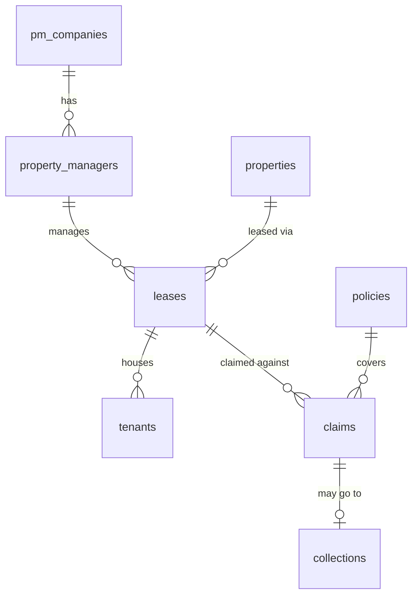

# Security Deposit Claims — Database Schema

Schema for the claims adjudication app, derived from `Claims.xlsx` (first tab: "Security Deposit Claims", 1,244 claim rows, 48 columns).

**Bold** = column extracted from the Excel sheet. Plain = generated keys, foreign keys, or app-managed fields.

## Entity relationships

Import order (parents before children): `pm_companies` → `property_managers` → `properties` → `policies` → `leases` → `tenants` → `claims` → `collections`.

## Tables

### pm_companies

| column | type | source / notes |
|---|---|---|
| pm_company_id | SERIAL PK | generated |
| name | TEXT NOT NULL UNIQUE | **Property Management Company** |

### property_managers

| column | type | source / notes |
|---|---|---|
| pm_id | SERIAL PK | generated |
| pm_company_id | INT FK → pm_companies | |
| name | TEXT NOT NULL | **Property Manager Name** |

### properties

| column | type | source / notes |
|---|---|---|
| property_id | SERIAL PK | generated |
| street_address | TEXT NOT NULL | **Lease Street Address** |
| city | TEXT NOT NULL | **Lease City** |
| state | CHAR(2) NOT NULL | **Lease State** |
| zip | VARCHAR(10) NOT NULL | **Lease Zip** |

Unique on (street_address, city, state, zip).

### policies

| column | type | source / notes |
|---|---|---|
| policy_id | SERIAL PK | generated |
| policy_number | TEXT NOT NULL UNIQUE | **Policy** |
| group_number | TEXT | **Group #** |
| treaty_number | TEXT | **Treaty #** |
| max_benefit | NUMERIC(10,2) | **Max Benefit** |

### leases

| column | type | source / notes |
|---|---|---|
| lease_id | SERIAL PK | generated |
| property_id | INT FK → properties | |
| pm_id | INT FK → property_managers | |
| start_date | DATE | **Lease Start Date** |
| end_date | DATE | **Lease End Date** |
| move_out_date | DATE | **Move-Out Date** |
| monthly_rent | NUMERIC(10,2) | **Monthly Rent** |

### tenants

One row per tenant per lease (1–3 rows per claim row).

| column | type | source / notes |
|---|---|---|
| tenant_id | SERIAL PK | generated |
| lease_id | INT FK → leases | |
| tenant_number | SMALLINT NOT NULL | derived from **Is there a 2nd Tenant?** / **Is there a 3rd Tenant?** (flags decide row count, then are discarded) |
| relationship | TEXT | **#2 Relationship** (null for primary tenant) |
| employer_name | TEXT | **Primary Tenant Employer Name** / **#2 Tenant Employer Name** |
| employer_phone | VARCHAR(20) | **#2 Tenant Employer Phone #** |

Unique on (lease_id, tenant_number).

### claims

| column | type | source / notes |
|---|---|---|
| claim_id | SERIAL PK | generated |
| lease_id | INT FK → leases | |
| policy_id | INT FK → policies | |
| tracking_number | TEXT NOT NULL UNIQUE | **Tracking Number** |
| claim_date | DATE | **Claim Date** |
| claim_amount | NUMERIC(10,2) | **Amount of Claim** |
| termination_type | TEXT | **Termination Type** (Move-Out / Eviction) |
| status | TEXT | **Status** (Posted / Declined / Approved / …) |
| pending_docs_from_pm | BOOLEAN | **Pending Docs from PM** |
| approval_date | DATE | **Approval Date** |
| approved_benefit_amount | NUMERIC(10,2) | **Approved Benefit Amount** |
| pm_explanation | TEXT | **PM Explanation** |
| hold_reason | TEXT | **Hold Reason** |
| posted_date | DATE | **Posted Date** |
| pm_notified_at | DATE | **PM Notification of Claim Received** |
| audit_selected | BOOLEAN | **Audit Selection** |
| exception_flag | BOOLEAN | **(unnamed column AF)** — internal exception marker, meaning TBC with sheet owner |
| needs_adjudication_review | BOOLEAN | **Review Claim Adjudication** |
| tenant_info_reviewed | BOOLEAN | **Review Tenant Information** |
| policy_info_updated | BOOLEAN | **Update YRIG Policy Info** |
| pm_info_viewed | BOOLEAN | **View PM Information** |
| collections_opened | BOOLEAN | **Open Collections** |

### collections

Created only when a claim row has collection data (1:1 with claims).

| column | type | source / notes |
|---|---|---|
| collection_id | SERIAL PK | generated |
| claim_id | INT FK → claims, UNIQUE | |
| referred_at | TIMESTAMPTZ | **Send to Collections** (empty in current file; becomes the hand-off timestamp in the app) |
| collection_status | TEXT | **Collection Status** |
| tenant_contacted | BOOLEAN | **Tenant Contacted** |
| tenant_collection_status | TEXT | **Tenant Collection Status** |
| settlement_amount | NUMERIC(10,2) | **Agreed Tenant Settlement** |
| settlement_date | DATE | **Agreed Tenant Settlement Date** |
| collected_date | DATE | **Collected Date** |
| collected_amount | NUMERIC(10,2) | **Collected Amount** |
| collection_processed_date | DATE | **Collection Processed Date** |

## Excel column accounting (48 columns)

| bucket | count | columns |
|---|---|---|
| Stored as values | 45 | everything bolded above except Send to Collections |
| Mapped, empty in current file | 1 | Send to Collections → `collections.referred_at` |
| Consumed as row-count logic, not stored | 2 | Is there a 2nd Tenant?, Is there a 3rd Tenant? (recoverable as `count(*)` on tenants) |

All 48 columns accounted for; no data discarded.

## Notes

- Duplicate-upload protection: unique constraint on `claims.tracking_number` fails loudly on re-import of the same file.
- Known data quirks in `Claims.xlsx` to handle at import: text in numeric columns (e.g. "per Micky at PM…" in Approved Benefit Amount), "Test Claim" rows to skip, 204 posted claims with no Amount of Claim, `exception_flag` true on 17 anomalous rows.
- Recommended indexes: `claims(status)`, `claims(lease_id)`, `leases(property_id)`, `tenants(lease_id)`, `collections(collection_status)`.
